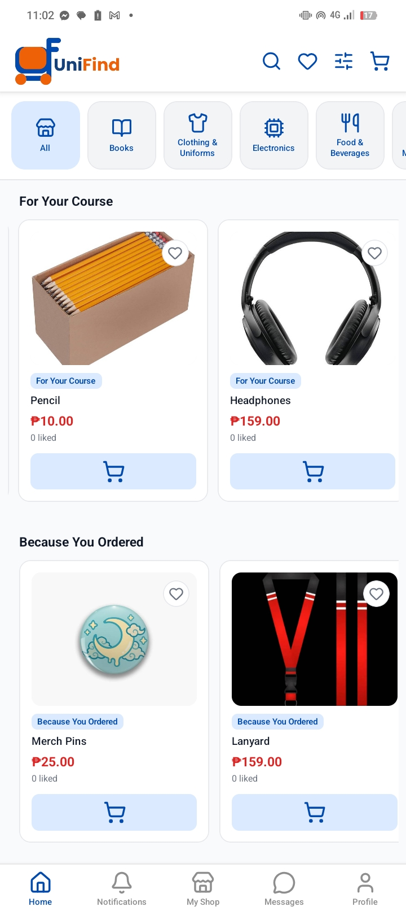
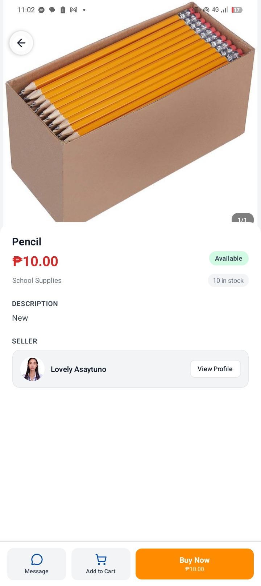
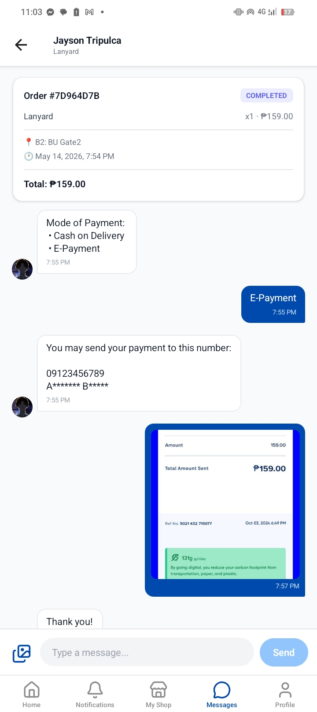

# UniFind-mobile

> A Content-based Personalized Marketplace App for BUeños

   

---

UniFind was built to make student-to-student transactions personalized, faster, more organized, and safer within the BU campus, while promoting affordability and sustainability through item reuse.

---

<table>
  <tr>
    <td></td>
    <td></td>
    <td></td>
  </tr>
</table>     

---

## How It Works

### 1. Sign in with your BU Google account
Only `@bicol-u.edu.ph` emails are accepted. Non-BU accounts are blocked at the server level before account creation.

### 2. Browse listings or post your own
Scroll on the Home feed or search by category/keyword. Add items to your cart or post your own with photos, a description, and a price.

### 3. Send an order request
Checkout submits an order to the seller. The seller reviews it and accepts or rejects. No payment happens inside the app.

### 4. Chat and meet on campus
Use the built-in chat to arrange payment method and meetup location. After completion, both parties can leave a review.

---

## Features

- 🔐 BU-exclusive access via Google Sign-In
- 🏠 Personalized listing recommendations
- 🛍️ Browse and post listings with photos
- 🛒 Cart and checkout system
- 💬 Built-in messaging between buyers and sellers
- ⭐ Seller and buyer reviews with detailed ratings
- 🔍 Full-text search across listings
- 🏪 Shop profiles for every seller
- 🔔 In-app notifications
- 📋 Order management for buyers and sellers
- ❤️ Wishlist for saving listings

---

## Download

**Requires Android 7.0 (API 24) or higher.**

1. Download the latest APK from [Releases](https://github.com/zionabyrke/UniFind-mobile/releases/latest)
2. On your Android device, go to **Settings -> Install unknown apps** and allow your browser or file manager
3. Open the downloaded APK and tap Install
4. Sign in with your `@bicol-u.edu.ph` Google account

> ⚠️ UniFind is not yet available on the Google Play Store. Direct APK installation is required.

---

## Support the Project

UniFind is free and maintained by amateur students. If you'd like to help expand this app enough to cover development tools and future costs, any support is appreciated.

---

### Mission:
> To provide students with a trusted digital marketplace that makes buying and selling easier, safer, and more accessible.

### Vision:
> To become the go-to campus marketplace where every student can connect, trade, and support one another within the university community.

---

## About the Developers

We are a group of five 3rd Year Bachelor of Science in Computer Science students from Bicol University.

| Collaborators |
|---|
| Asaytuno, Lovely L. |
| Latagan, Joshua Rene |
| Onia, Renz Kirby |
| Tripulca, Jayson |
| Zurbito, Juan Miguel |

---

*© 2025 UniFind*